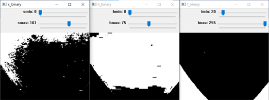
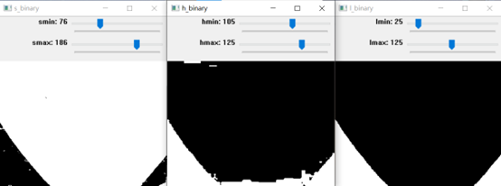

# lane_detect.py

部署在后板，后板包含机器狗的运动相关控制模块，通过接受前板信息，执行预定的机器控制，实现机器狗任务过程中的整体运动及调控。

## 配置及环境：

A1机器狗

RealSense 深度摄像头  D435i 

[OpenCV](https://sourceforge.net/projects/opencvlibrary/files/opencv-unix/)

[Socket通信模块](https://github.com/socketio/socket.io-client/tree/master/dist)

## 运行方法：

将A1狗开机，电脑连接到A1的WIFI，输入密码进行登录。

通过终端对前板进行SSH连接 ：`ssh unitree@193.168.123.12` 

输入A1狗的密码，即可将电脑连接到A1狗前板。

进入文件目录	`cd cv_robocom`

运行程序	`python lane_detect.py`

## 实现原理：

#### 直线行走的图像检测原理：

​	我们首先获取图像的有效底和有效顶，两者之间的区域为有效图像。通过图像处理，同时可以计算当前的中心点位置，对于机器狗直线行走过程中出现的横纵位置偏移问题，控制程序是基于图像识别获取到的中心点信息，并进行对应的修正，使机器狗保持沿中心直线行走的过程。

#### 转弯行走的图像检测原理：

​	我们的程序根据前方图像识别到路线的面积大小，进行继续行走还是转弯的逻辑判断。当前进的路线小于设定值，且判断左侧或右侧出现新延申的部分道路，则发出对应的左转或右转信号，使行走部分的程序接受信号，进入转弯模式。

中心点计算公式：

`cx = int(M['m10'] / M['m00'])  cy = int(M['m01'] / M['m00']) 其中心点坐标为（cx,cy）`

### 调整HSV的参数：

​	HSV通过合适的阈值处理图像，达到准确识别的效果，根据不同的场地，需要调整不同的阈值参数。

​										    					调参前道路识别效果

​    													   	调参后道路识别效果	